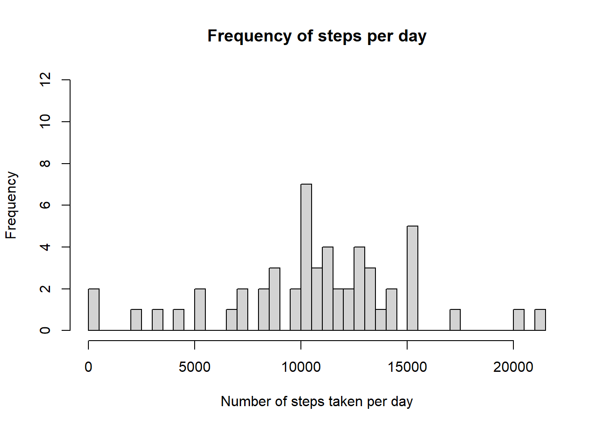
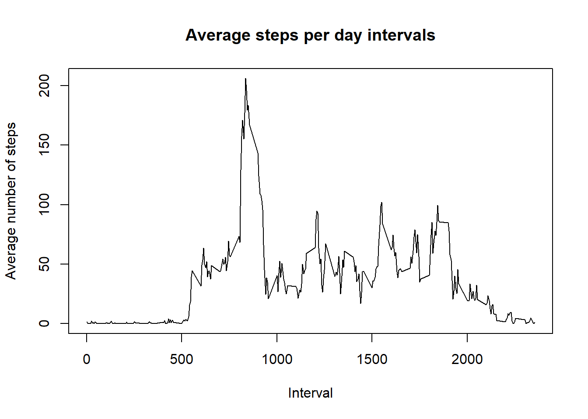
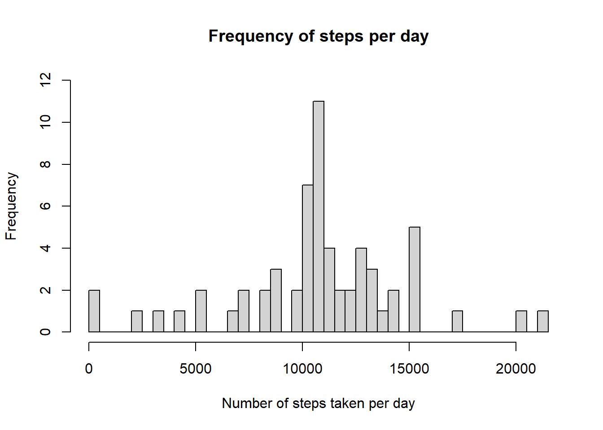
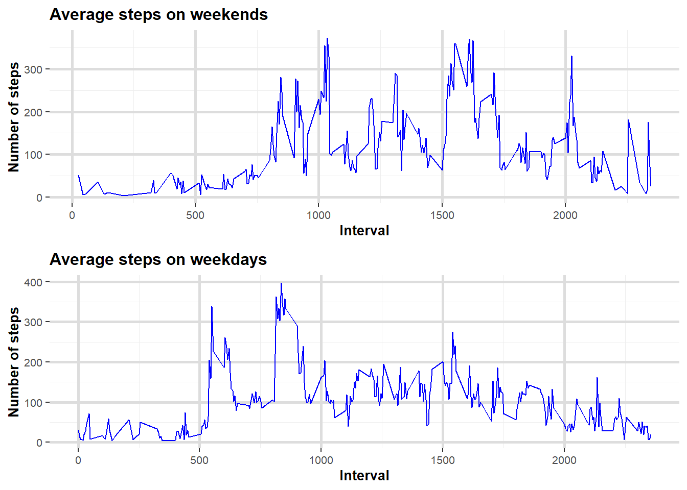

## Loading and preprocessing the data

```r
activity_data <- read.csv("activity.csv")
activity_data$date <- as.Date(activity_data$date, "%Y-%m-%d")
```


## What is mean total number of steps taken per day?

The sum of all steps displayed as a histogram per day

```r
sum_of_steps <- na.omit(activity_data)
sum_of_steps <- sum_of_steps %>%
  select(date, steps) %>%
  group_by(date) %>%
  summarise(sum = sum(steps))

total_median <- median(sum_of_steps$sum)
total_mean <- mean(sum_of_steps$sum)

hist(sum_of_steps$sum, 
     breaks = 50,
     main = "Frequency of steps per day",
     xlab = "Number of steps taken per day",
     ylim = c(0, 12)
)
```

<!-- -->

The mean of all the steps is '10766.1886792', where the median of all the steps is '10765'.


## What is the average daily activity pattern?

```r
my_steps <- na.omit(activity_data)

my_steps <- my_steps %>%
  select(interval, steps) %>%
  group_by(interval) %>%
  summarise(mean = mean(steps))

max_mean <- max(my_steps$mean)
max_interval <- my_steps[my_steps$mean == max_mean, ]

plot(x = my_steps$interval, 
     y = my_steps$mean, 
     type="l",
     main = "Average steps per day intervals",
     xlab = "Interval",
     ylab = "Average number of steps")
```

<!-- -->

The interval at 835 has the greatest mean, which is 206.1698113.

## Imputing missing values
There are 2304 missing values. The missing values will 
be replaced by the over all mean, which is 37.3825996 .


```r
new_data_set <- activity_data

index = 0
overall_mean <- mean(na.omit(activity_data$steps))

for(index in 1:nrow(new_data_set))
{
  df <- new_data_set[index, ]
  if(is.na(df$steps))
  {
    new_data_set[index, 1] <- overall_mean
  }
  
  index = index + 1
}

sum_of_steps <- na.omit(new_data_set)
sum_of_steps <- sum_of_steps %>%
  select(date, steps) %>%
  group_by(date) %>%
  summarise(sum = sum(steps))

total_median <- median(sum_of_steps$sum)
total_mean <- mean(sum_of_steps$sum)

hist(sum_of_steps$sum, 
     breaks = 50,
     main = "Frequency of steps per day",
     xlab = "Number of steps taken per day",
     ylim = c(0, 12)
)
```

<!-- -->

Since provided a very basic functionality to just fill the missing values with
the mean of all steps of all the dates, there is an increase of the counts
for that value. Other values around the lower or upper areas of the histogram
don't change.
The mean of all the steps after replacing the missing values with the overall mean
is '10766.1886792', where the median of all the steps is '10766.1886792'.


## Are there differences in activity patterns between weekdays and weekends?
There are differences visible. During weekends you can see that activities start
rather later in the day around 09:00, where during the week activities start
shortly after 05:00. During weekends people seem to be overall more active also
during late hours such as 20:00.


```r
weekend_days <- c("Sa", "So", "Sat", "Sun")
week_data <- na.omit(activity_data)
week_data <- mutate(week_data, sapply(week_data$date, function(day){
  if(weekdays(day, TRUE) %in% weekend_days)
  {
    return ("weekend")
  }
  else
  {
    return ("weekday")
  } 
}))

weekend_data <- week_data[week_data$steps > 0 & week_data[4] == "weekend", ]
weekdays_data <- week_data[week_data$steps > 0 & week_data[4] == "weekday", ]

colnames(week_data)[4] <- c("Weekday")
colnames(weekend_data)[4] <- c("Weekday")
colnames(weekdays_data)[4] <- c("Weekday")

weekend_data <- weekend_data %>%
  select(interval, steps) %>%
  group_by(interval) %>%
  summarise(mean = mean(steps))
weekdays_data <- weekdays_data %>%
  select(interval, steps) %>%
  group_by(interval) %>%
  summarise(mean = mean(steps))

weekend_plot <- ggplot(weekend_data, aes(x = interval, y = mean)) +
  geom_line(color = "blue") +
  labs(title = "Average steps on weekends") +
   xlab("Interval") +
   ylab("Number of steps") +
   theme(
    panel.background = element_rect(fill = "white", colour = "white", size = 1.5, linetype = "solid"),
    panel.grid.major = element_line(size = 1, linetype = 'solid', colour = "#DDDDDD"), 
    panel.grid.minor = element_line(size = 0.25, linetype = 'solid', colour = "#EEEEEE"),
    plot.title = element_text(size=12, face = "bold"),
    axis.text = element_text(size = 8),
    axis.title = element_text(size = 10, face = "bold")
  )

weekdays_plot <- ggplot(weekdays_data, aes(x = interval, y = mean)) +
  geom_line(color = "blue") +
  labs(title = "Average steps on weekdays") +
   xlab("Interval") +
   ylab("Number of steps") +
   theme(
    panel.background = element_rect(fill = "white", colour = "white", size = 1.5, linetype = "solid"),
    panel.grid.major = element_line(size = 1, linetype = 'solid', colour = "#DDDDDD"), 
    panel.grid.minor = element_line(size = 0.25, linetype = 'solid', colour = "#EEEEEE"),
    plot.title = element_text(size=12, face = "bold"),
    axis.text = element_text(size = 8),
    axis.title = element_text(size = 10, face = "bold")
  )

grid.arrange(weekend_plot, weekdays_plot, nrow = 2)
```

<!-- -->

